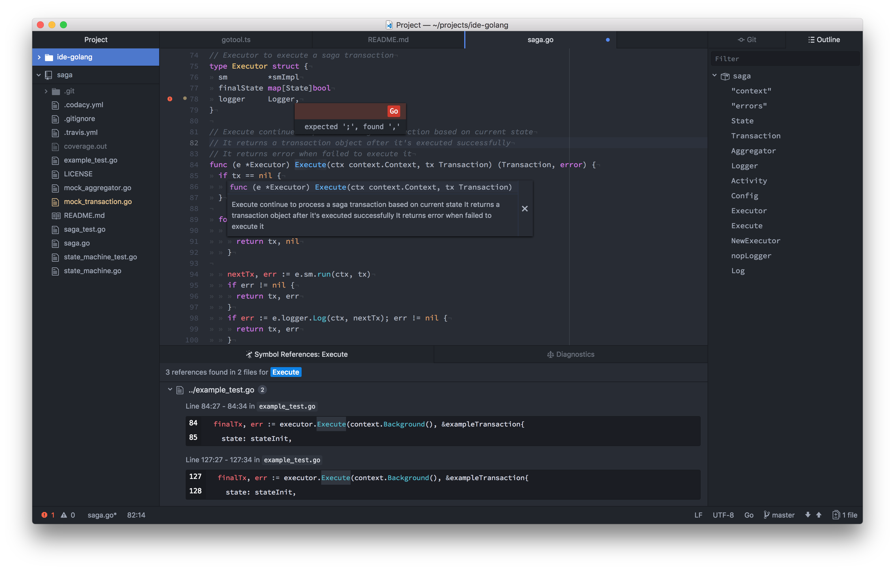
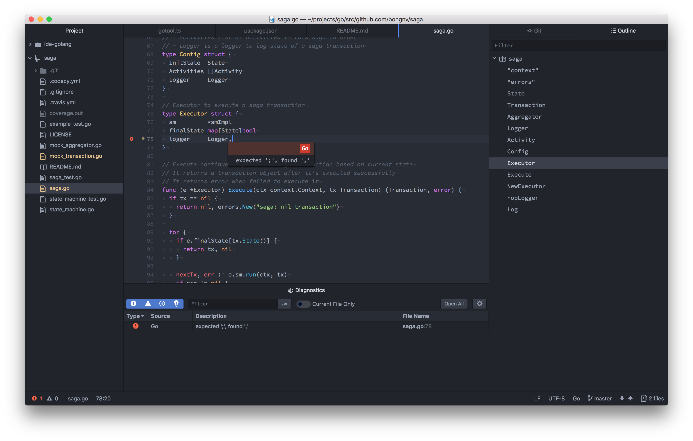

# ide-golang Atom package &middot; [](https://www.codacy.com/app/vanbong/atom-ide-golang?utm_source=github.com&amp;utm_medium=referral&amp;utm_content=bongnv/atom-ide-golang&amp;utm_campaign=Badge_Grade) [](https://travis-ci.org/bongnv/atom-ide-golang) [](https://greenkeeper.io/)

Go language support for [Atom-IDE](https://github.com/facebook-atom/atom-ide-ui). Since ide-golang is till in early stage, if you happen to experience any problem, please don't hesitate to file an issue [here](https://github.com/bongnv/atom-ide-golang/issues/new).




## Features
- Code Completion (using `gocode`)
- Code Format (using `goimports`)
- Diagnostics
- Document outline (using `go-outline`)
- Find references (using `guru`)
- Go to definition (using `guru`)
- Hover (using `gogetdoc`)
- Lint check after saving (using `golint`)

## Getting Started
First, make sure you have Atom 1.19+ installed. Install [atom-ide-ui](https://atom.io/packages/atom-ide-ui) from "Install" in Atom's settings or run:

```shell
apm install atom-ide-ui
```
Then, install [ide-golang](https://github.com/bongnv/atom-ide-golang) from "Install" in Atom's settings or run:

```shell
apm install ide-golang
```
You probably need to install some golang tools:
```shell
go get -u golang.org/x/tools/cmd/goimports
go get -u github.com/nsf/gocode
go get -u github.com/zmb3/gogetdoc
go get -u golang.org/x/tools/cmd/guru
go get -u github.com/ramya-rao-a/go-outline
go get -u golang.org/x/lint/golint
```

## TODO
- [x] Golint support
- [ ] Configs for GOPATH & tools
- [x] CI
- [x] Unit tests
- [ ] Compilation support

## License
See [`LICENSE`](LICENSE) file
