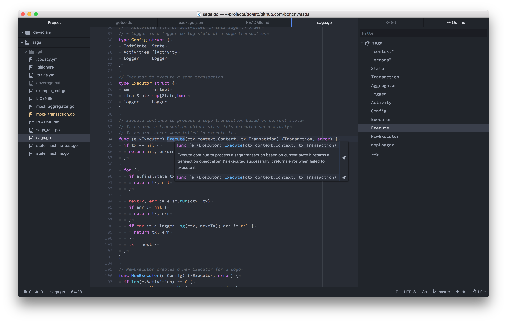

# ide-golang Atom package
Go language support for [Atom-IDE](https://github.com/facebook-atom/atom-ide-ui). You should also install the [atom-ide-ui](https://atom.io/packages/atom-ide-ui) package to expose the functionality with Atom.




## Features
-   Code Completion (using `gocode`)
-   Code Format (using `goimports`)
-   Diagnostics
-   Document outline (using `go-outline`)
-   Find references (using `guru`)
-   Go to definition (using `guru`)
-   Hover (using `gogetdoc`)

## Getting Started
First, make sure you have Atom 1.19+ installed. Install [atom-ide-ui](https://atom.io/packages/atom-ide-ui) from "Install" in Atom's settings or run:

```shell
apm install atom-ide-ui
```
Then, install [ide-golang](https://github.com/bongnv/atom-ide-golang) from "Install" in Atom's settings or run:

```shell
apm install ide-golang
```
You probably need to install some golang tools:
```shell
go get -u golang.org/x/tools/cmd/goimports
go get -u github.com/nsf/gocode
go get -u github.com/zmb3/gogetdoc
go get -u golang.org/x/tools/cmd/guru
go get -u github.com/ramya-rao-a/go-outline
```

## TODO
- [ ] Golint support
- [ ] Configs for GOPATH & tools
- [ ] CI
- [ ] Unit tests
- [ ] Compilation support

## License
See [`LICENSE`](LICENSE) file
